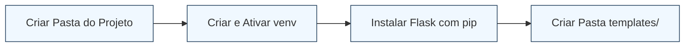
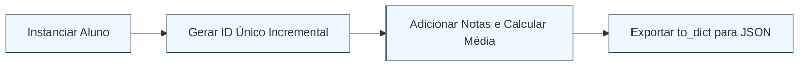
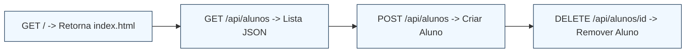
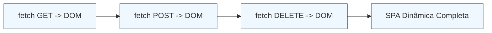
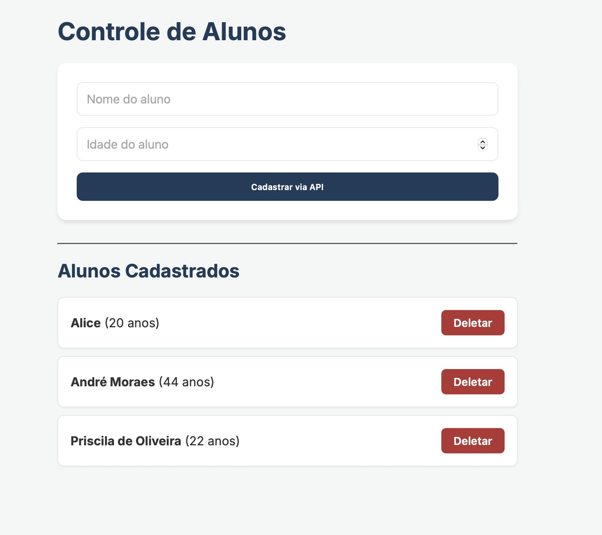

# Roteiro Prático 07 — Integração Frontend com API no Flask

## Objetivos da Aula
Ao final desta aula, o estudante será capaz de:
*   Compreender o conceito de **desacoplamento** (separação física e lógica entre Frontend e Backend);
*   Transformar uma aplicação Flask convencional em uma **API REST** que recebe e responde dados no formato **JSON**;
*   Consumir rotas de API utilizando a **Fetch API** do JavaScript no navegador;
*   Manipular a árvore **DOM** para exibir, cadastrar e remover elementos HTML dinamicamente em tempo real, **sem recarregar a página** (Single Page Application - SPA).

---

## 1. Fundamentação Teórica: Desacoplamento e APIs REST

Até a nossa última aula prática (Roteiro 05), a nossa aplicação Flask funcionava no modelo **Server-Side Rendering (SSR)**. Isso significa que o servidor Flask processava os dados e montava o arquivo HTML completo (substituindo as tags do Jinja2 como ``) antes de enviá-lo ao navegador. Sempre que um aluno era cadastrado ou removido, o navegador precisava recarregar a tela inteira (tela piscando em branco).

No desenvolvimento profissional moderno, utilizamos o modelo **Client-Side Rendering (CSR)** com APIs:
*   **O Backend (Flask):** Funciona estritamente como um servidor de dados (uma API REST). Ele não se importa com a aparência visual do site; ele apenas recebe requisições HTTP e responde com dados puros organizados no formato **JSON** (JavaScript Object Notation).
*   **O Frontend (HTML, CSS e JavaScript):** Carrega uma vez no navegador e passa a se comunicar de forma assíncrona (em segundo plano) com o backend utilizando **Fetch API**. O JavaScript recebe o JSON com os dados e "desenha" as mudanças na tela usando manipulação do **DOM**.

```mermaid
graph TD
    subgraph Frontend [Cliente: Navegador (HTML / JS Fetch)]
        A[Interface SPA] -- "1. fetch('/api/alunos') GET" --> B(Fetch API)
        F[Formulário Cadastro] -- "3. fetch('/api/alunos', POST) JSON" --> B
        H[Botão Remover] -- "5. fetch('/api/alunos/id', DELETE)" --> B
    end

    subgraph Backend [Servidor: Flask (app.py)]
        B -- "Requisições HTTP" --> C{Rotas /api/}
        C -- "GET /api/alunos" --> D[listar_alunos]
        C -- "POST /api/alunos" --> E[adicionar_aluno]
        C -- "DELETE /api/alunos/id" --> G[api_remover_aluno]
    end

    subgraph Memory [Memória RAM]
        D -- "Ler dados" --> I[(Lista alunos)]
        E -- "Inserir objeto" --> I
        G -- "Excluir objeto" --> I
    end

    D -- "2. Retorna Lista JSON" --> B
    E -- "4. Retorna Objeto JSON (201)" --> B
    G -- "6. Retorna Mensagem Sucesso (200)" --> B
    
    style Frontend fill:#f0f8ff,stroke:#1e3c5a,stroke-width:2px
    style Backend fill:#fff0f0,stroke:#b43232,stroke-width:2px
    style Memory fill:#fffff0,stroke:#cca300,stroke-width:2px
```

### De onde viemos (Roteiro 05) para onde vamos (Roteiro 07)

Para compreender a evolução técnica da aula de hoje, analise as diferenças fundamentais de arquitetura:

| Aspecto | Roteiro 05: Flask CRUD (SSR) | Roteiro 07: API e Fetch (CSR) | O que Ganhamos com Isso? |
| :--- | :--- | :--- | :--- |
| **Papel do Flask** | **Injeção de Layout + Dados:** O Flask processa os dados e monta o HTML no servidor usando Jinja2. | **Serviço de Dados Puro:** O Flask vira uma **API REST** que apenas recebe e responde JSON. | **Desacoplamento:** O backend fica focado estritamente na lógica de dados e regras de negócio. |
| **Navegação** | **Recarregamento Completo (Hard Reload):** Toda ação do usuário recarrega a página inteira. | **Atualização Cirúrgica (SPA):** O JavaScript intercepta a ação e altera apenas o HTML necessário. | **Fluidez:** A aplicação ganha velocidade e parece um aplicativo nativo instalado. |
| **Tráfego de Dados** | **Form Data (`request.form`):** Dados enviados como parâmetros clássicos de formulário. | **JSON (`request.get_json()`):** Dados trafegam de forma estruturada e padronizada. | **Padronização:** JSON é o padrão universal de tráfego de dados na internet. |
| **Reuso de Código** | **Preso ao Layout:** O backend só serve para aquele site específico (amarrado ao Jinja2). | **Totalmente Desacoplado:** O mesmo backend atende o site web, apps mobile (iOS/Android) ou outros servidores. | **Escalabilidade:** Permite atender múltiplos clientes sem duplicar código. |

#### Comparação Prática de Fluxo e Código

**1. Rota de Cadastro no Flask**
```python
# ROTEIRO 05 (Jinja2 / Form Data)
@app.route("/alunos", methods=["POST"])
def adicionar_aluno():
    nome = request.form["nome"]
    idade = int(request.form["idade"])
    alunos.append(Aluno(nome, idade))
    return redirect("/")  # Recarrega a tela

# ROTEIRO 07 (API REST / JSON)
@app.route("/api/alunos", methods=["POST"])
def api_adicionar_aluno():
    dados = request.get_json()
    novo_aluno = Aluno(dados["nome"], int(dados["idade"]))
    alunos.append(novo_aluno)
    return jsonify(novo_aluno.to_dict()), 201  # Retorna dados puros
```

**2. Exibição de Dados no Frontend**
```html
<!-- ROTEIRO 05 (Jinja2 no Servidor) -->
<ul>
    
        <li>{{ aluno.nome }} - {{ aluno.idade }} anos</li>
    
</ul>

<!-- ROTEIRO 07 (DOM Dinâmico no Cliente com JS) -->
<ul id="lista-alunos"></ul>
<script>
    fetch('/api/alunos')
        .then(res => res.json())
        .then(alunos => {
            alunos.forEach(aluno => {
                const li = document.createElement('li');
                li.innerHTML = `<strong>${aluno.nome}</strong> - ${aluno.idade} anos`;
                listaAlunos.appendChild(li);
            });
        });
</script>
```

---

## 2. Preparando a Estrutura do Roteiro 07

Para garantir que você consiga executar este roteiro mesmo se quiser começar do absoluto zero (sem depender de códigos de aulas anteriores), siga as etapas de preparação abaixo:

### Passo 0: Preparando o Ambiente do Zero



Abra o terminal do seu computador e execute os seguintes comandos para configurar o ambiente do projeto:

1. **Crie a pasta do projeto e entre nela:**
   ```bash
   mkdir roteiro07-integracao-api
   cd roteiro07-integracao-api
   ```
2. **Crie e ative o ambiente virtual (venv) para isolar as dependências:**
   *No macOS/Linux:*
   ```bash
   python3 -m venv venv
   source venv/bin/activate
   ```
   *No Windows (CMD):*
   ```cmd
   python -m venv venv
   venv\Scripts\activate
   ```
3. **Instale o Flask:**
   ```bash
   pip install Flask
   ```
4. **Crie a pasta de templates HTML:**
   ```bash
   mkdir templates
   ```

### Estrutura de Pastas:
```
roteiro07-integracao-api/
├── venv/
├── aluno.py
├── app.py
└── templates/
    └── index.html
```
*(Nota: O ambiente virtual `venv/` não deve ser enviado ao Git. Caso utilize repositórios, lembre-se de adicionar a pasta `venv/` ao seu arquivo `.gitignore`.)*

---

## Passo 1: Ajustando o Modelo (Classe `Aluno`)



Para podermos deletar ou editar registros específicos através de chamadas de API, precisamos saber exatamente qual ID estamos manipulando. Vamos garantir que a classe `Aluno` no arquivo `aluno.py` exporte seu `id` no dicionário JSON.

### Atualize o arquivo `aluno.py`:
```python
class Aluno:
    contador = 1  # Contador estático para gerar IDs únicos

    def __init__(self, nome, idade):
        self.id = Aluno.contador
        self.nome = nome
        self.idade = idade
        self.notas = []
        Aluno.contador += 1

    def adicionar_nota(self, nota):
        self.notas.append(nota)

    def calcular_media(self):
        if not self.notas:
            return 0
        return sum(self.notas) / len(self.notas)

    def aprovado(self):
        return self.calcular_media() >= 7

    # Método crucial que transforma o objeto em um Dicionário Python 
    # que o Flask consegue converter em formato JSON (texto bruto)
    def to_dict(self):
        return {
            "id": self.id,
            "nome": self.nome,
            "idade": self.idade,
            "media": self.calcular_media(),
            "aprovado": self.aprovado(),
        }
```

---

## Passo 2: Construindo a API no Backend (`app.py`)



No arquivo `app.py`, faremos modificações importantes. A nossa rota principal `/` apenas entregará a página HTML base uma única vez. Todas as outras interações de dados (listar, cadastrar, deletar) serão feitas por rotas exclusivas de API prefixadas com `/api/`.

### Substitua o conteúdo do arquivo `app.py`:
```python
from flask import Flask, jsonify, request, render_template
from aluno import Aluno

app = Flask(__name__)

# Banco de dados simulado em memória
alunos = []

# Inicializando com alguns dados de teste
aluno1 = Aluno("João Silva", 17)
aluno1.adicionar_nota(8.5)
aluno2 = Aluno("Maria Souza", 16)
aluno2.adicionar_nota(9.0)

alunos.append(aluno1)
alunos.append(aluno2)

# ==========================================
# 1. ROTA DE TELA (HTML Estático)
# ==========================================
@app.route("/", methods=["GET"])
def pagina_inicial():
    # Retorna o arquivo HTML sem injetar dados via Jinja2
    return render_template("index.html")

# ==========================================
# 2. ROTAS DE API (Endpoints JSON)
# ==========================================

# ROTA A: Listar Alunos (GET)
@app.route("/api/alunos", methods=["GET"])
def listar_alunos():
    # Converte Alunos para dicionários usando to_dict()
    alunos_dict = [aluno.to_dict() for aluno in alunos]
    return jsonify(alunos_dict), 200

# ROTA B: Adicionar um novo aluno (POST)
@app.route("/api/alunos", methods=["POST"])
def adicionar_aluno():
    # Extrai os dados do corpo da requisição JSON
    dados = request.get_json()
    nome = dados.get("nome")
    idade = dados.get("idade")

    # Valida os dados recebidos
    if not nome or not isinstance(idade, int):
        return jsonify({
            "error": "Dados inválidos. 'nome' deve ser string e 'idade' int."
        }), 400

    # Cria um novo objeto Aluno e adiciona à lista de alunos
    novo_aluno = Aluno(nome, idade)
    alunos.append(novo_aluno)

    return jsonify(novo_aluno.to_dict()), 201

# ROTA C: Remover Aluno (DELETE)
@app.route("/api/alunos/<int:id>", methods=["DELETE"])
def api_remover_aluno(id):
    global alunos
    # Verifica se o aluno existe
    aluno_existe = any(aluno.id == id for aluno in alunos)
    
    if not aluno_existe:
        return jsonify({"erro": "Aluno não encontrado"}), 404
        
    # Remove o aluno da lista
    alunos = [aluno for aluno in alunos if aluno.id != id]
    return jsonify({"mensagem": f"Aluno {id} removido com sucesso"}), 200

if __name__ == "__main__":
    app.run(debug=True, host="0.0.0.0", port=5000)
```

---

## Passo 3: Criando a Interface no Frontend (`index.html`)



Agora, a nossa página HTML é estática. Ela não possui laços de repetição do Jinja2 (``). Em vez disso, ela possui um contêiner vazio (uma lista `<ul>` com o ID `lista-alunos`) que o JavaScript usará para desenhar os alunos na tela.

### Crie o arquivo `templates/index.html`:
```html
<!DOCTYPE html>
<html lang="pt-br">

<head>
    <meta charset="UTF-8">
    <meta name="viewport" content="width=device-width, initial-scale=1.0">
    <title>Controle de Alunos</title>
</head>

<body>
    <h1>Controle de Alunos</h1>
    <form id="formulario-cadastro">
        <input type="text" id="nome" placeholder="Nome do aluno" required>
        <input type="number" id="idade" placeholder="Idade do aluno" required>
        <button type="submit">Cadastrar via API</button>
    </form>
    <hr>
    <h2>Alunos Cadastrados</h2>
    <ul id="lista-alunos"></ul>

    <script>
        const API_URL = '/api/alunos';
        const listaAlunos = document.getElementById('lista-alunos');
        const formulario = document.getElementById('formulario-cadastro');
        const inputNome = document.getElementById('nome');
        const inputIdade = document.getElementById('idade');

        function carregarAlunos() {
            fetch(API_URL)
                .then(response => response.json())
                .then(alunos => {
                    listaAlunos.innerHTML = '';
                    alunos.forEach(aluno => {
                        desenharAlunoNaTela(aluno);
                    });
                });
        }

        // Carrega os alunos colocando-os como novos
        // elementos em uma lista HTML
        function desenharAlunoNaTela(aluno) {
            const li = document.createElement('li');
            li.id = `aluno-${aluno.id}`;
            li.innerHTML = `
                <span><strong>${aluno.nome}</strong> 
                      (${aluno.idade} anos)</span> 
                <button onclick="deletarAluno(${aluno.id})">
                    Deletar
                </button>
            `;
            listaAlunos.appendChild(li);
        }

        formulario.addEventListener('submit', function (event) {
            // Evita o envio tradicional/recarga padrão
            event.preventDefault();
            
            const dados = { 
                nome: inputNome.value, 
                idade: parseInt(inputIdade.value) 
            };
            
            fetch(API_URL, {
                method: 'POST',
                headers: { 'Content-Type': 'application/json' },
                body: JSON.stringify(dados) // Envia como JSON
            })
                .then(res => res.json()) // Converte em JSON
                .then(aluno => {
                    desenharAlunoNaTela(aluno); // Desenha aluno
                    formulario.reset(); // Limpa campos
                });
        });

        function deletarAluno(id) {
            if (!confirm('Deseja realmente deletar?')) return;
            
            fetch(`${API_URL}/${id}`, { method: 'DELETE' })
                .then(response => {
                    if (response.ok) {
                        const el = document.getElementById(
                            `aluno-${id}`
                        );
                        if (el) el.remove(); // Remove da tela
                    } else {
                        alert('Erro ao deletar o aluno.');
                    }
                });
        }

        // Executado automaticamente ao carregar a página
        window.addEventListener('DOMContentLoaded', carregarAlunos);
    </script>
</body>

</html>
```

---

## 4. Testando a Aplicação de Forma Segura

Siga as etapas abaixo para executar e inspecionar sua aplicação, diferenciando a dinâmica desta arquitetura daquela desenvolvida no **Roteiro 05**:

1. **Inicie o servidor local:** No terminal com seu ambiente virtual ativo, rode o comando:
   ```bash
   python app.py
   ```
2. **Abra o navegador no endereço:** `http://localhost:5001` (para evitar conflitos de porta no macOS).
3. **Abra a Ferramenta do Desenvolvedor (DevTools):** Pressione **F12** (ou clique com o botão direito -> *Inspecionar*).
4. **Filtre as requisições assíncronas:** Vá na aba **Network (Rede)** e clique no filtro **Fetch/XHR**.
5. **Cadastre um aluno ou delete um registro e observe a diferença:**
   * **No Roteiro 05 (SSR - Server-Side Rendering):** O formulário realizava um envio completo dos dados, limpava a página ativa, forçava o servidor a renderizar um novo HTML inteiramente e dava um *hard reload* (a tela inteira piscava em branco e o histórico da aba Rede era apagado).
   * **No Roteiro 07 (API/SPA - Single Page Application):** A página permanece viva e **não recarrega** (não pisca). Na lista de requisições do filtro **Fetch/XHR**, você verá conexões sendo efetuadas dinamicamente em segundo plano:
     - Um `POST` assíncrono para `/api/alunos` ao cadastrar.
     - Um `DELETE` assíncrono para `/api/alunos/<id>` ao clicar no botão "Deletar".
6. **Inspecione os dados JSON:** Clique sobre qualquer uma das requisições assíncronas Fetch geradas na lista da aba Rede e vá na sub-aba **Response (Resposta)**. Você poderá visualizar o arquivo **JSON puro** (os dados encapsulados em texto estruturado) que foi enviado ou retornado pelo Flask!

O resultado final da aplicação Single Page Application (SPA) estilizada em execução no navegador é demonstrado na imagem a seguir:



---

## 5. Estilização da Interface (Opcional — CSS Premium)

Para dar um acabamento profissional, fluido e moderno à interface da sua aplicação Single Page Application (SPA), você pode criar uma folha de estilos CSS personalizada que aproveita transições e efeitos de micro-animação.

### Passos para aplicar a estilização:

1. **Crie a pasta estática na raiz do seu projeto:**
   ```bash
   mkdir static
   ```
2. **Crie o arquivo `static/style.css` e cole as regras a seguir:**
   ```css
    @import url(
      'https://fonts.googleapis.com/css2?family=Inter:wght@400;700'
    );

   :root {
       --bg-color: #f4f7f6;
       --card-bg: #ffffff;
       --primary-color: #1e3c5a;
       --primary-hover: #122538;
       --text-color: #333333;
       --border-color: #e2e8f0;
       --danger-color: #b43232;
       --danger-hover: #8c2525;
   }

   body {
       font-family: 'Inter', sans-serif;
       background-color: var(--bg-color);
       color: var(--text-color);
       max-width: 600px;
       margin: 40px auto;
       padding: 20px;
   }

   h1, h2 {
       color: var(--primary-color);
       font-weight: 700;
   }

   form {
       background-color: var(--card-bg);
       padding: 25px;
       border-radius: 12px;
       box-shadow: 0 4px 6px -1px rgba(0,0,0,0.1), 0 2px 4px -1px rgba(0,0,0,0.06);
       margin-bottom: 30px;
       display: flex;
       flex-direction: column;
       gap: 15px;
   }

   input {
       padding: 12px;
       border: 1px solid var(--border-color);
       border-radius: 8px;
       font-size: 1em;
       outline: none;
       transition: border-color 0.2s, box-shadow 0.2s;
   }

   input:focus {
       border-color: var(--primary-color);
       box-shadow: 0 0 0 3px rgba(30,60,90,0.15);
   }

   button[type="submit"] {
       padding: 12px;
       background-color: var(--primary-color);
       color: white;
       font-weight: 600;
       border: none;
       border-radius: 8px;
       cursor: pointer;
       transition: background-color 0.2s, transform 0.1s;
   }

   button[type="submit"]:hover {
       background-color: var(--primary-hover);
   }

   button[type="submit"]:active {
       transform: scale(0.98);
   }

   ul {
       list-style: none;
       padding: 0;
       display: flex;
       flex-direction: column;
       gap: 10px;
   }

   li {
       background-color: var(--card-bg);
       padding: 16px;
       border-radius: 8px;
       box-shadow: 0 1px 3px rgba(0,0,0,0.05);
       display: flex;
       justify-content: space-between;
       align-items: center;
       border: 1px solid var(--border-color);
       transition: transform 0.2s;
   }

   li:hover {
       transform: translateY(-2px);
       box-shadow: 0 4px 6px rgba(0,0,0,0.05);
   }

   .btn-deletar {
       background-color: var(--danger-color);
       color: white;
       padding: 8px 16px;
       border: none;
       border-radius: 6px;
       font-size: 0.9em;
       font-weight: 600;
       cursor: pointer;
       transition: background-color 0.2s;
   }

   .btn-deletar:hover {
       background-color: var(--danger-hover);
   }
   ```
3. **Vincule o arquivo CSS no seu HTML:** No arquivo `templates/index.html`, adicione a folha de estilos dentro do `<head>`:
   ```html
   <link rel="stylesheet" href="/static/style.css">
   ```
4. **Adicione a classe no botão de remoção dinâmico:** No script do seu `templates/index.html`, atualize a declaração do botão na função `desenharAlunoNaTela` para adotar o estilo premium:
   ```javascript
   li.innerHTML = `<span><strong>${aluno.nome}</strong> (${aluno.idade} anos)</span> 
                   <button class="btn-deletar" 
                           onclick="deletarAluno(${aluno.id})">
                       Deletar
                   </button>`;
   ```

---

## 5. Desafio Formativo da Aula

Agora que o sistema de alunos está funcionando inteiramente via API REST, utilize a mesma arquitetura para implementar a funcionalidade de adicionar notas a um aluno específico:

1.  Crie uma rota no Flask: `POST /api/alunos/<int:id>/notas` que recebe um JSON contendo `{"nota": 8.0}` e a adiciona à lista de notas daquele Aluno na memória. Devolva o dicionário atualizado do aluno.
2.  No Frontend (HTML), insira um pequeno campo numérico ao lado da listagem de notas ou crie um segundo formulário simples que faça essa chamada com o método `POST`.
3.  Atualize a média e o status de aprovação exibidos na tela dinamicamente ao receber a resposta de sucesso do servidor.
