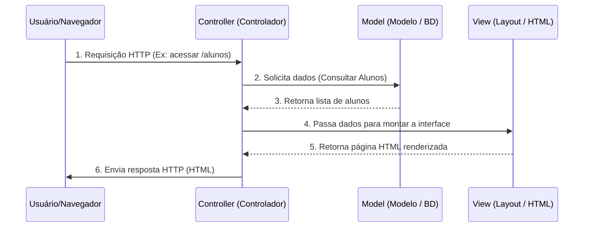
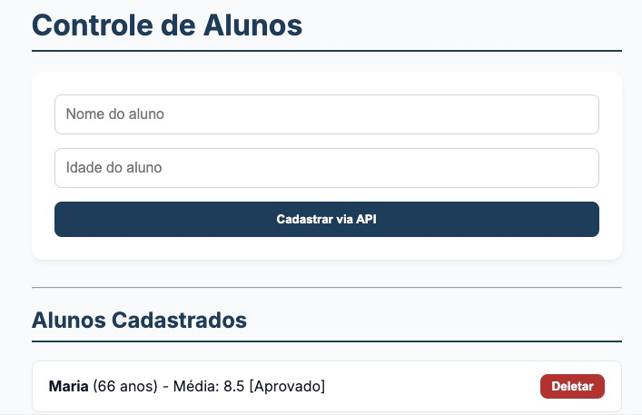

# Roteiro Prático 08 — Transição para Django e Padrões de Projeto

## Objetivos da Aula
Ao final desta aula, o estudante será capaz de:
*   Compreender o padrão de arquitetura de software **MVC (Model-View-Controller)** e sua adaptação no Django, o **MTV (Model-Template-View)**;
*   Realizar a transição prática de uma aplicação backend baseada em Flask para o framework **Django**;
*   Substituir a persistência de dados volátil (lista em memória RAM) pelo **Django ORM** conectado a um banco de dados **SQLite**;
*   Desenvolver rotas de API REST em Django que recebem e respondem no formato **JSON** usando `JsonResponse`;
*   Habilitar e configurar o painel administrativo nativo do Django (**Django Admin**) para gerenciar os dados da aplicação.

---

## 1. Fundamentação Teórica: Padrões de Projeto e Arquitetura MVC vs. MTV

À medida que as aplicações web crescem, organizar o código torna-se um desafio. Para evitar o surgimento de arquivos gigantescos contendo regras de negócio, lógica de banco de dados e layout misturados (o famoso "código espaguete"), a engenharia de software define os **Padrões de Projeto (Design Patterns)** e **Padrões Arquiteturais**.

O padrão arquitetural mais consagrado para a Web é o **MVC (Model-View-Controller)**:
*   **Model (Modelo):** Representa a estrutura dos dados e as regras de negócio. É quem conversa com o banco de dados.
*   **View (Visão):** É a interface visual que o usuário vê (páginas HTML, telas de aplicativos, etc.).
*   **Controller (Controlador):** É o cérebro intermediário. Ele intercepta as requisições HTTP do usuário, decide qual Model chamar para processar a informação e, por fim, seleciona qual View exibir em resposta.



### O Padrão MTV do Django

O Django adota uma variação do MVC chamada **MTV (Model-Template-View)**. Na prática, o conceito é idêntico, mudando apenas a nomenclatura de algumas peças:

*   **Model:** Igual ao MVC. Define as classes Python que mapeiam para tabelas do banco de dados (através do ORM).
*   **Template (equivalente à View do MVC):** Contém a parte visual (HTML, CSS e sintaxe de template do Django) responsável por formatar e apresentar os dados.
*   **View (equivalente ao Controller do MVC):** Contém a lógica de programação que recebe requisições, faz consultas ao banco através do Model e retorna a resposta (renderizando um Template ou retornando um JSON).
*   **Quem é o Controller no Django?** O próprio framework Django! O motor interno de rotas (URL Dispatcher) intercepta a requisição HTTP e a encaminha automaticamente para a View correspondente.

---

## 2. Comparativo: Flask vs. Django

Para facilitar a transição do microframework Flask para o framework robusto Django, veja como os principais conceitos se alinham:

| Aspecto / Recurso | Flask (Roteiro 07) | Django (Roteiro 08) |
| :--- | :--- | :--- |
| **Filosofia** | **Microframework:** Você escolhe e monta sua estrutura de pastas, banco de dados e bibliotecas. | **Framework "Batteries-Included":** Vem com estrutura rígida de pastas, ORM, painel administrativo e segurança pré-configurados. |
| **Estrutura de Pastas** | Manual. Geralmente arquivos planos (`app.py`, `aluno.py`). | Padronizada por comandos. Divisão em **Projeto** (configurações) e **Apps** (módulos da aplicação). |
| **Banco de Dados** | Em memória (lista Python `alunos = []`) ou SQL manual. | **Django ORM (Object-Relational Mapper):** Cria e gerencia o banco através de classes Python sem escrever SQL. |
| **Mapeamento de Rotas** | Decoradores diretamente nas funções (`@app.route`). | Arquivos centrais de roteamento (`urls.py`). |
| **Painel de Controle** | Inexistente (precisa ser desenvolvido do zero). | **Django Admin:** Interface administrativa robusta gerada automaticamente. |
| **Retorno de JSON** | Função `jsonify()` importada do Flask. | Classe `JsonResponse` importada de `django.http`. |

---

## 3. Mapeamento de Mudanças e Impacto na Aplicação

Para efetuar a transição do Flask para o Django, o nosso código sofrerá reestruturações importantes. A tabela a seguir descreve o que muda e qual o impacto direto dessa alteração na arquitetura e funcionamento do projeto:

| Arquivo/Conceito Original (Flask) | Novo Componente (Django) | Mudança Prática no Código | Impacto na Aplicação |
| :--- | :--- | :--- | :--- |
| **`aluno.py` (Classe Pura)** | **`alunos/models.py` (Django Model)** | A classe agora herda de `models.Model` e seus campos são definidos com tipos do banco de dados (ex: `models.CharField`, `models.IntegerField`). | **Persistência Real:** Os dados deixam de existir apenas na memória RAM e passam a ser salvos no disco rígido (banco SQLite). |
| **`alunos = []` (Lista em RAM)** | **`db.sqlite3` (Banco de Dados)** | Em vez de manipular uma lista na memória RAM, usamos o ORM do Django para fazer operações (ex: `Aluno.objects.all()`, `aluno.delete()`). | **Persistência e Confiabilidade:** Reiniciar o servidor ou o computador não apaga mais as informações cadastradas. |
| **`app.py` (Arquivo Único)** | **`views.py` e `urls.py` (Desacoplados)** | A lógica de tratamento das requisições fica separada do mapeamento de rotas e configurações. | **Modularidade e Organização:** Permite o crescimento ordenado do sistema de forma profissional (padrão MVC/MTV). |
| **`@app.route()` (Decoradores)** | **`alunos/urls.py` (URL Dispatcher)** | As rotas são mapeadas em listas centralizadas de caminhos no arquivo `urls.py`. | **Gerenciamento Centralizado:** Facilidade para visualizar, manter e modificar as URLs do sistema em um único local. |
| **`jsonify()`** | **`JsonResponse`** | Retornamos instâncias de `JsonResponse(dados)` enviando dicionários obtidos pelo método `to_dict()`. | **Padronização:** Respostas JSON nativas e seguras com cabeçalhos HTTP corretos gerenciados pelo próprio framework. |

### Fluxo Comparativo de Arquitetura (Croqui de Transição)

Para visualizar como a comunicação com o Frontend Single Page Application (SPA) se reestrutura em relação à aula anterior, analise a diferença dos fluxos na comparação abaixo:

```mermaid
graph TD
    subgraph Arquitetura Anterior: Flask (Roteiro 07)
        A1[Navegador / Cliente] -- "fetch() GET/POST" --> B1[Servidor Flask app.py]
        B1 -- "Escrita/Leitura direta" --> C1[Lista na Memória RAM alunos = []]
        style C1 fill:#f9f,stroke:#333,stroke-width:2px
    end

    subgraph Nova Arquitetura: Django (Roteiro 08)
        A2[Navegador / Cliente] -- "fetch() GET/POST/DELETE" --> B2[Servidor Django urls.py -> views.py]
        B2 -- "Operações de ORM" --> C2[Model alunos/models.py]
        C2 -- "Gravação Física" --> D2[Banco de Dados db.sqlite3]
        style D2 fill:#bbf,stroke:#333,stroke-width:2px
    end
```

No Flask (Roteiro 07), o servidor lidava com todas as rotas e gravava as alterações em uma lista volátil. No Django, a requisição é direcionada pelo roteador central (`urls.py`), processada pela camada lógica controladora (`views.py`), que utiliza o objeto de abstração de dados (`models.py`) para consultar ou persistir permanentemente no banco local (`db.sqlite3`). O Frontend consome os mesmos endpoints JSON, fazendo com que a interface SPA atualize cirurgicamente sem notar a troca do motor de backend.

---

## 4. Roteiro Prático: Criando e Migrando a Aplicação para Django

> [!TIP]
> O código-fonte completo desta atividade prática está disponível no repositório oficial da disciplina no GitHub: [escola_project no GitHub](https://github.com/chameoandre/topicos-avancados-andre-2026/tree/main/roteiro-08-django-padroes-projeto/escola_project).

Vamos recriar o backend da nossa aplicação de cadastro de alunos usando a arquitetura de projetos do Django, mas aproveitando o mesmo frontend Single Page Application (SPA) que criamos no Roteiro 07.

### Parte 0 – Criando o Projeto e App no Django

**Por que fazemos isso?** O Django exige que organizemos o código em um contêiner global (o **Projeto**) e em módulos independentes de funcionalidades (os **Apps**). Aqui, vamos instalar o framework e inicializar a estrutura básica do projeto `escola_project` e o app `alunos`.

No Django, um **Projeto** representa o site/sistema como um todo (configurações globais, banco de dados, roteamento central). Um **App** é um módulo funcional específico dentro do projeto (por exemplo, o módulo de gerenciamento de `alunos`).

Com seu terminal aberto e com o ambiente virtual `venv` ativado, instale o Django e gere os arquivos iniciais:

```bash
# 1. Instale o Django dentro da venv
pip install django

# 2. Crie o projeto Django chamado "escola_project" no diretório atual
django-admin startproject escola_project .

# 3. Crie o aplicativo (app) chamado "alunos"
django-admin startapp alunos
```

A estrutura de diretórios gerada automaticamente pelo Django deve ser semelhante a esta:

```text
roteiro08-django-padroes/
├── escola_project/
│   ├── __init__.py
│   ├── asgi.py
│   ├── settings.py      # Configurações globais
│   ├── urls.py          # Rotas centrais
│   └── wsgi.py
├── alunos/
│   ├── migrations/      # Histórico de alterações do banco de dados
│   ├── __init__.py
│   ├── admin.py         # Configuração do Django Admin
│   ├── apps.py
│   ├── models.py        # Modelos (Estrutura de Dados)
│   ├── tests.py
│   └── views.py         # Lógica das rotas (Controllers)
├── manage.py            # Utilitário de linha de comando do Django
└── db.sqlite3           # Banco de dados local (criado após rodar migrações)
```

---

### Parte 1 – Registrando a App e Configurando o Projeto

**Por que fazemos isso?** O Django precisa saber quais módulos (apps) estão ativos no projeto para carregar seus modelos e rotas. Também configuramos o idioma e o fuso horário para que o banco e o sistema operem no padrão local de forma nativa.

Abra o arquivo `escola_project/settings.py` e execute as seguintes alterações para registrar nosso aplicativo `alunos` no sistema e traduzir as configurações de idioma:

1. Localize a lista de `INSTALLED_APPS` e adicione o seu app `'alunos'` ao final:
   ```python
   # escola_project/settings.py
   INSTALLED_APPS = [
       'django.contrib.admin',
       'django.contrib.auth',
       'django.contrib.contenttypes',
       'django.contrib.sessions',
       'django.contrib.messages',
       'django.contrib.staticfiles',
       
       # Nosso aplicativo registrado
       'alunos',
   ]
   ```

2. Vá ao final do arquivo e configure a localização para português brasileiro e fuso horário local:
   ```python
   # escola_project/settings.py
   LANGUAGE_CODE = 'pt-br'
   TIME_ZONE = 'America/Sao_Paulo'
   ```

---

### Parte 2 – Criando o Model com o Django ORM (alunos/models.py)

**Por que fazemos isso?** A camada Model define a estrutura lógica dos dados. O Django ORM permite que definamos tabelas de banco de dados usando classes Python simples. O framework se encarrega de criar e gerenciar a chave primária (`id`) automaticamente de forma autoincremental.

No Flask, criamos uma classe Python convencional e controlamos o `id` manualmente usando um contador estático. No Django, herdamos de `models.Model`. O Django ORM criará automaticamente uma chave primária (`id`) autoincremental e cuidará de toda a persistência no banco SQLite.

Substitua o conteúdo de `alunos/models.py` pelo código a seguir:

```python
from django.db import models

class Aluno(models.Model):
    # Campos da tabela de banco de dados
    nome = models.CharField(max_length=100, verbose_name="Nome Completo")
    idade = models.IntegerField(verbose_name="Idade")
    nota = models.FloatField(default=0.0, verbose_name="Média de Notas")

    def aprovado(self):
        # Regra de negócio: Média maior ou igual a 7 para aprovação
        return self.nota >= 7.0

    # Método auxiliar para retornar o objeto como dicionário (serialização)
    def to_dict(self):
        return {
            "id": self.id,
            "nome": self.nome,
            "idade": self.idade,
            "media": self.nota,
            "aprovado": self.aprovado(),
        }

    # Como o objeto será representado como texto no painel administrativo
    def __str__(self):
        return f"{self.nome} ({self.idade} anos)"
```

---

### Parte 3 – Criando e Aplicando as Migrações (Database Setup)

**Por que fazemos isso?** O Django não altera as tabelas do banco de dados automaticamente ao salvarmos o arquivo `models.py`. Precisamos primeiro gerar os planos de migração (`makemigrations`) e depois executá-los (`migrate`) para que o banco físico SQLite seja sincronizado.

Sempre que criamos ou alteramos um arquivo `models.py`, precisamos notificar o Django para atualizar as tabelas físicas do banco de dados. Esse processo ocorre em duas etapas no terminal:
1.  **`makemigrations`**: O Django analisa a classe Python e gera um arquivo de roteiro de migração (ex: `0001_initial.py`).
2.  **`migrate`**: O Django executa esse roteiro e cria fisicamente as tabelas correspondentes no banco de dados local SQLite (`db.sqlite3`).

Execute os comandos abaixo no seu terminal:

```bash
# 1. Gerar os blueprints das migrações
python manage.py makemigrations

# 2. Executar as migrações (criar tabelas internas do Django + tabela de Alunos)
python manage.py migrate
```

---

### Parte 4 – Construindo as Views da API REST (alunos/views.py)

**Por que fazemos isso?** A View (Controller) gerencia as requisições HTTP enviadas pelo usuário. Como nosso frontend é uma aplicação de página única (SPA), nossas views não devem retornar páginas HTML inteiras em cada requisição; em vez disso, retornam dados estruturados em JSON (`JsonResponse`) para que o JavaScript os renderize na tela.

No Flask, usávamos decoradores de rota na mesma função. No Django, a lógica fica em `views.py` e o mapeamento de endereços fica em `urls.py`. Como estamos lidando com requisições assíncronas assinaladas via JavaScript `fetch` contendo JSON, utilizaremos o `JsonResponse` do Django e o decorador `@csrf_exempt` (para fins didáticos, desabilitaremos a proteção CSRF padrão do Django para facilitar requisições diretas de testes locais).

Abra `alunos/views.py` e insira o código das funções controladoras:

```python
import json
from django.http import JsonResponse
from django.views.decorators.csrf import csrf_exempt
from django.shortcuts import render
from .models import Aluno

# ==========================================
# 1. ROTA DE TELA (HTML Estático)
# ==========================================
def pagina_inicial(request):
    # Renderiza o arquivo index.html contido na pasta de templates
    return render(request, 'index.html')

# ==========================================
# 2. ROTAS DE API (Endpoints JSON)
# ==========================================

@csrf_exempt
def api_alunos(request):
    # Caso 1: Listar Alunos (GET)
    if request.method == 'GET':
        # Consulta todos os alunos gravados no banco SQLite
        lista_alunos = Aluno.objects.all()
        # Converte a lista em dicionários
        dados = [aluno.to_dict() for aluno in lista_alunos]
        return JsonResponse(dados, safe=False, status=200)

    # Caso 2: Criar Aluno (POST)
    elif request.method == 'POST':
        try:
            # Extrai os dados do corpo da requisição JSON
            payload = json.loads(request.body)
            nome = payload.get('nome')
            idade = payload.get('idade')
            # Nota padrão inicial (por exemplo, 8.5) para compatibilidade com o croqui
            nota_inicial = payload.get('media', 8.5)

            if not nome or not isinstance(idade, int):
                return JsonResponse({"erro": "Dados inválidos."}, status=400)

            # Grava fisicamente o novo aluno no banco SQLite
            novo_aluno = Aluno.objects.create(
                nome=nome,
                idade=idade,
                nota=nota_inicial
            )
            return JsonResponse(novo_aluno.to_dict(), status=201)
            
        except json.JSONDecodeError:
            return JsonResponse({"erro": "JSON inválido."}, status=400)

@csrf_exempt
def api_aluno_detalhe(request, id):
    # Caso 3: Deletar Aluno (DELETE)
    if request.method == 'DELETE':
        try:
            # Busca o aluno pelo ID correspondente
            aluno = Aluno.objects.get(id=id)
            aluno.delete() # Remove do SQLite
            return JsonResponse({"mensagem": "Aluno removido com sucesso"}, status=200)
        except Aluno.DoesNotExist:
            return JsonResponse({"erro": "Aluno não encontrado"}, status=404)
```

---

### Parte 5 – Mapeando as URLs

**Por que fazemos isso?** O Django usa o arquivo `urls.py` (URL Dispatcher) para mapear os caminhos digitados no navegador e associá-los às funções controladoras corretas do arquivo `views.py`. Criamos arquivos locais no app e os incluímos no roteador central do projeto para garantir a modularidade.

Precisamos estruturar o sistema de roteamento. O projeto Django possui um arquivo central `urls.py`. Nós criaremos um roteamento local em `alunos/urls.py` e o incluiremos no central para manter o código modular.

1. Crie o arquivo `alunos/urls.py` e configure as rotas locais:
   ```python
   # alunos/urls.py
   from django.urls import path
   from . import views

   urlpatterns = [
       # Rota principal (Tela)
       path('', views.pagina_inicial, name='pagina_inicial'),
       
       # Endpoints de API REST
       path('api/alunos', views.api_alunos, name='api_alunos'),
       path('api/alunos/<int:id>', views.api_aluno_detalhe, name='api_aluno_detalhe'),
   ]
   ```

2. Abra o arquivo central de rotas `escola_project/urls.py` e configure para incluir as rotas do app `alunos`:
   ```python
   # escola_project/urls.py
   from django.contrib import admin
   from django.urls import path, include

   urlpatterns = [
       path('admin/', admin.site.urls), # Painel Administrativo
       path('', include('alunos.urls')), # Inclui rotas do nosso app
   ]
   ```

---

### Parte 6 – Integrando a Interface SPA Estática (index.html e CSS)

**Por que fazemos isso?** O Django organiza recursos de visualização de forma isolada. Colocamos arquivos HTML na pasta `templates/` e arquivos auxiliares (como CSS e JavaScript) na pasta `static/`, ensinando o framework a localizá-los e servi-los de forma otimizada com tags como ``.

O Django gerencia os templates (HTML) e arquivos estáticos (CSS, imagens e JS) de forma mais organizada do que o Flask. Por padrão, ele busca templates dentro de subpastas chamadas `templates/` criadas dentro de cada aplicação.

1. Crie a estrutura de pastas necessária dentro de `alunos/`:
   ```bash
   mkdir -p alunos/templates
   mkdir -p alunos/static
   ```

2. Mova ou crie o arquivo `alunos/templates/index.html` com o código abaixo. Note que adicionamos a tag `` no início para permitir a carga correta do arquivo CSS no padrão do Django:
   ```html
   <!-- alunos/templates/index.html -->
   
   <!DOCTYPE html>
   <html lang="pt-br">
   <head>
       <meta charset="UTF-8">
       <meta name="viewport" content="width=device-width, initial-scale=1.0">
       <title>Controle de Alunos (Django API)</title>
       <!-- Carga de CSS dinâmico do Django -->
       <link rel="stylesheet" href="">
   </head>
   <body>
       <h1>Controle de Alunos</h1>
       <form id="formulario-cadastro">
           <input type="text" id="nome" placeholder="Nome do aluno" required>
           <input type="number" id="idade" placeholder="Idade do aluno" required>
           <button type="submit">Cadastrar via API</button>
       </form>
       <hr>
       <h2>Alunos Cadastrados</h2>
       <ul id="lista-alunos"></ul>

       <script>
           const API_URL = '/api/alunos';
           const listaAlunos = document.getElementById('lista-alunos');
           const formulario = document.getElementById('formulario-cadastro');
           const inputNome = document.getElementById('nome');
           const inputIdade = document.getElementById('idade');

           function carregarAlunos() {
               fetch(API_URL)
                   .then(response => response.json())
                   .then(alunos => {
                       listaAlunos.innerHTML = '';
                       alunos.forEach(aluno => {
                           desenharAlunoNaTela(aluno);
                       });
                   });
           }

           function desenharAlunoNaTela(aluno) {
               const li = document.createElement('li');
               li.id = `aluno-${aluno.id}`;
               li.innerHTML = `
                   <span><strong>${aluno.nome}</strong> 
                         (${aluno.idade} anos) - Média: ${aluno.media} 
                         [${aluno.aprovado ? 'Aprovado' : 'Reprovado'}]</span> 
                   <button class="btn-deletar" onclick="deletarAluno(${aluno.id})">
                       Deletar
                   </button>
               `;
               listaAlunos.appendChild(li);
           }

           formulario.addEventListener('submit', function (event) {
               event.preventDefault();
               
               const dados = { 
                   nome: inputNome.value, 
                   idade: parseInt(inputIdade.value),
                   media: 8.5 // Média padrão inicial
               };
               
               fetch(API_URL, {
                   method: 'POST',
                   headers: { 'Content-Type': 'application/json' },
                   body: JSON.stringify(dados)
               })
                   .then(res => res.json())
                   .then(aluno => {
                       desenharAlunoNaTela(aluno);
                       formulario.reset();
                   });
           });

           function deletarAluno(id) {
               if (!confirm('Deseja realmente deletar este aluno?')) return;
               
               fetch(`${API_URL}/${id}`, { method: 'DELETE' })
                   .then(response => {
                       if (response.ok) {
                           const el = document.getElementById(`aluno-${id}`);
                           if (el) el.remove();
                       } else {
                           alert('Erro ao deletar o aluno.');
                       }
                   });
           }

           window.addEventListener('DOMContentLoaded', carregarAlunos);
       </script>
   </body>
   </html>
   ```

3. Crie o arquivo `alunos/static/style.css` e cole a folha de estilos correspondente:
   ```css
   /* alunos/static/style.css */
   @import url('https://fonts.googleapis.com/css2?family=Inter:wght@400;600;700&display=swap');

   :root {
       --bg-color: #f8fafc;
       --card-bg: #ffffff;
       --primary-color: #1e3c5a;
       --primary-hover: #122538;
       --text-color: #0f172a;
       --border-color: #cbd5e1;
       --danger-color: #b43232;
       --danger-hover: #8c2525;
   }

   body {
       font-family: 'Inter', sans-serif;
       background-color: var(--bg-color);
       color: var(--text-color);
       max-width: 650px;
       margin: 40px auto;
       padding: 20px;
   }

   h1, h2 {
       color: var(--primary-color);
       font-weight: 700;
       border-bottom: 2px solid var(--primary-color);
       padding-bottom: 8px;
   }

   form {
       background-color: var(--card-bg);
       padding: 25px;
       border-radius: 12px;
       box-shadow: 0 4px 6px -1px rgba(0,0,0,0.05), 0 2px 4px -2px rgba(0,0,0,0.05);
       margin-bottom: 30px;
       display: flex;
       flex-direction: column;
       gap: 15px;
   }

   input {
       padding: 12px;
       border: 1px solid var(--border-color);
       border-radius: 8px;
       font-size: 1em;
       outline: none;
       transition: border-color 0.2s;
   }

   input:focus {
       border-color: var(--primary-color);
   }

   button {
       padding: 12px 18px;
       border: none;
       border-radius: 8px;
       cursor: pointer;
       font-weight: 600;
       transition: background-color 0.2s;
   }

   button[type="submit"] {
       background-color: var(--primary-color);
       color: white;
   }

   button[type="submit"]:hover {
       background-color: var(--primary-hover);
   }

   ul {
       list-style: none;
       padding: 0;
   }

   li {
       background-color: var(--card-bg);
       border: 1px solid #e2e8f0;
       padding: 14px 18px;
       border-radius: 8px;
       margin-bottom: 10px;
       display: flex;
       justify-content: space-between;
       align-items: center;
       box-shadow: 0 1px 3px rgba(0,0,0,0.02);
   }

   .btn-deletar {
       background-color: var(--danger-color);
       color: white;
       padding: 6px 12px;
       font-size: 0.85em;
   }

   .btn-deletar:hover {
       background-color: var(--danger-hover);
   }
   ```

---

### Parte 7 – Habilitando o Painel Administrativo (Django Admin)

**Por que fazemos isso?** Um dos diferenciais do Django é fornecer uma interface administrativa robusta pré-construída para que desenvolvedores gerenciem dados em tabelas do banco de dados graficamente, eliminando a necessidade de construir painéis de controle administrativos do zero.

Uma das maiores vantagens do Django é o seu painel de controle pré-construído. Para podermos utilizá-lo, precisamos registrar o nosso modelo `Aluno` nas configurações administrativas e criar um usuário de administração global (**superuser**).

1. Abra `alunos/admin.py` e registre a classe:
   ```python
   # alunos/admin.py
   from django.contrib import admin
   from .models import Aluno

   # Registra o modelo para aparecer no Django Admin
   admin.site.register(Aluno)
   ```

2. No terminal, crie o superusuário de administração:
   ```bash
   python manage.py createsuperuser
   ```
   *   O terminal solicitará que você defina um **Nome de usuário (Username)**, **Endereço de e-mail (Email address)** e **Senha (Password)**. Insira dados simples (ex: `admin`, seu e-mail e uma senha de no mínimo 8 caracteres) e pressione Enter.

---

## 5. Testando a Aplicação e Comparando Persistência

Vamos iniciar o servidor de desenvolvimento do Django e validar o funcionamento integrado do sistema:

1.  Inicie o servidor de desenvolvimento na porta `8000`:
    ```bash
    python manage.py runserver
    ```
2.  Abra seu navegador e acesse a tela do sistema: `http://127.0.0.1:8000/`.
3.  Cadastre alguns alunos na interface web. Observe que, assim como no Roteiro 07, o cadastro ocorre dinamicamente de forma SPA (sem piscar a tela) via requisições assíncronas do Fetch API.

    

4.  **Teste de Persistência:**
    *   No terminal, aperte `Ctrl + C` para desligar o servidor Django.
    *   Inicie-o novamente usando `python manage.py runserver`.
    *   Recarregue a página no navegador.
    *   *O que aconteceu?* No Flask, os alunos cadastrados sumiam após reiniciar porque eram mantidos em memória RAM (`alunos = []`). No Django, os alunos continuam exibidos na tela porque foram gravados permanentemente no banco SQLite local.
5.  **Acessando o Django Admin:**
    *   No navegador, acesse: `http://127.0.0.1:8000/admin`.
    *   Insira o nome de usuário e a senha do superusuário que você criou no passo anterior.
    *   Na página inicial, clique em **Alunos** para listar, cadastrar, editar e remover registros diretamente pelo painel administrativo padrão do framework.

---

## Links Importantes

* **Repositório da Disciplina (GitHub):** [Acesse a pasta do projeto escola_project no GitHub](https://github.com/chameoandre/topicos-avancados-andre-2026/tree/main/roteiro-08-django-padroes-projeto/escola_project)
